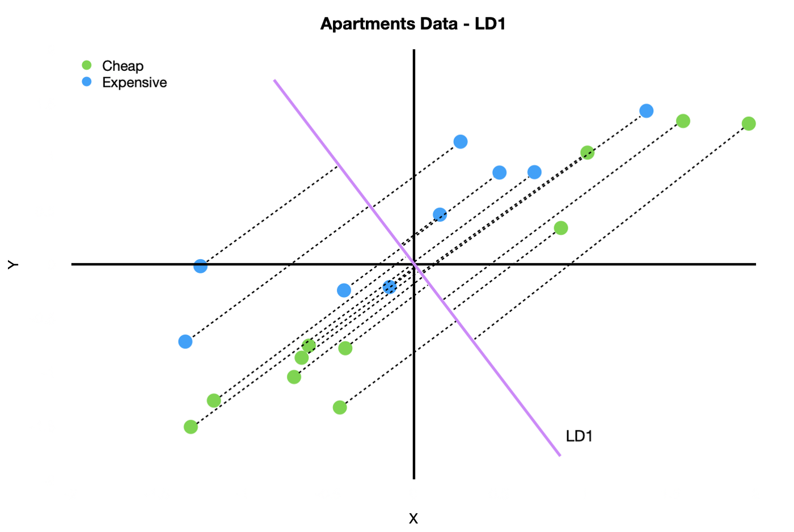

# Interactive Intro to Dimensionality Reduction

## Introduction

There already exists a plethora of notebooks discussing the merits of dimensionality reduction methods, in particular the Big 3 of PCA (Principal Component Analysis), LDA ( Linear Discriminant Analysis) and TSNE ( T-Distributed Stochastic Neighbour Embedding). Quite a handful of these have compared one to the other but few have gathered all 3 in one go. Therefore this notebook will aim to provide an introductory exposition on these 3 methods as well as to portray their visualisations interactively and hopefully more intuitively via the Plotly visualisation library. The chapters are structuredas follows:

1. **Principal Component Analysis ( PCA )** - Unsupervised, linear method
2. **Linear Discriminant Analysis (LDA)** - Supervised, linear method
3. **t-distributed Stochastic Neighbour Embedding (t-SNE)** - Nonlinear, probabilistic method

# 1. Principal Component Analysis (PCA)

In a nutshell, PCA is a linear transformation algorithm that seeks to project the original features of our data onto a smaller set of features ( or subspace ) while still retaining most of the information. To do this the algorithm tries to find the most appropriate directions/angles ( which are the principal components ) that maximise the variance in the new subspace. Why maximise the variance though?

To answer the question, more context has to be given about the PCA method. One has to understand that the principal components are orthogonal to each other ( think right angle ). As such when generating the covariance matrix ( measure of how related 2 variables are to each other ) in our new subspace, the off-diagonal values of the covariance matrix will be zero and only the diagonals ( or eigenvalues) will be non-zero. It is these diagonal values that represent the variances of the principal components that we are talking about or information about the variability of our features.

Therefore when PCA seeks to maximise this variance, the method is trying to find directions ( principal components ) that contain the largest spread/subset of data points or information ( variance ) relative to all the data points present.

# 2. Linear Discriminant Analysis 

Linear Discriminant Analysis (LDA) is a commonly used dimensionality reduction technique. However, despite the similarities to Principal Component Analysis (PCA), it differs in one crucial aspect.
Instead of finding new axes (dimensions) that maximize the variation in the data, it focuses on **maximizing the separability** among the known categories (classes) in the target variable.
In this article, I give an intuitive explanation of how LDA works while highlighting the differences to PCA. At the same time, I provide a Python example of performing Linear Discriminant Analysis on real-life data.

    